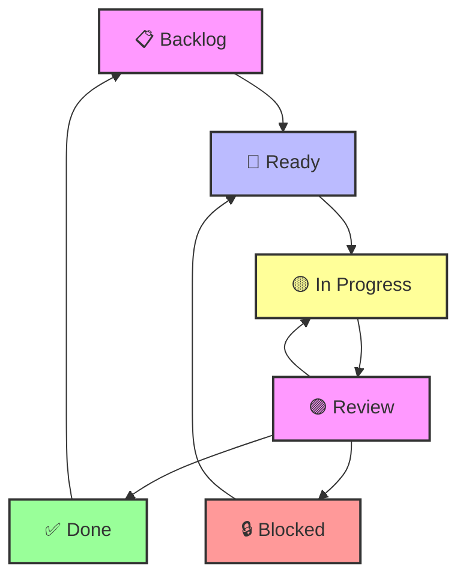

# Enhanced Review Workflow for AI-Assisted Project Management

**Implementation Date**: June 6, 2025  
**Version**: 2.0 - Enhanced Human Oversight  
**Status**: Active  

---

## Overview

The Enhanced Review Workflow introduces a **🟣 Review** status that creates a quality gate between AI implementation and task completion. This enables human oversight, iterative improvement, and ensures high-quality deliverables.

## Workflow States and Transitions

### Complete Workflow Diagram



### Status Definitions

| Status | Icon | Description | Who Controls | Next States |
|--------|------|-------------|--------------|-------------|
| **Backlog** | 📋 | Initial task state | System | Ready |
| **Ready** | 🔵 | No dependencies, ready to start | System | In Progress, Blocked |
| **Blocked** | 🔒 | Waiting for dependencies | System | Ready |
| **In Progress** | 🟡 | AI actively working | AI | Review |
| **Review** | 🟣 | **Awaiting human approval** | **Human** | Done, In Progress, Blocked |
| **Done** | ✅ | Task completed and approved | Human | - |

## Enhanced Workflow Scripts

### 1. **AI Workflow Scripts**

#### `start-workflow-task.sh <issue-number>`
- Moves task from Ready → In Progress
- Validates no dependencies and no other active tasks
- Updates both workflow and native status fields

#### `review-workflow-task.sh <issue-number> [message]`
- **NEW**: Moves task from In Progress → Review
- Adds review request comment with deliverables
- Notifies human reviewer of completion

### 2. **Human Oversight Scripts**

#### `approve-task.sh <issue-number> [approval-message]`
- **NEW**: Moves task from Review → Done
- Validates task is in Review status
- Adds approval comment and checks for dependent tasks

#### `request-rework.sh <issue-number> <feedback-message>`
- **NEW**: Moves task from Review → In Progress
- Adds detailed feedback comment
- Enables iterative improvement cycle

### 3. **Utility Scripts**

#### `query-workflow-status.sh`
- Enhanced to show Review status tasks
- Provides specific guidance for each status
- Shows available actions for human reviewers

## Human-AI Collaboration Patterns

### Pattern 1: Standard Approval Flow

```bash
# AI completes implementation
./scripts/review-workflow-task.sh 42 "FullBookingForm V2 integration complete"

# Human reviews and approves
./scripts/approve-task.sh 42 "Excellent integration, meets all requirements"
```

### Pattern 2: Iterative Improvement Flow

```bash
# AI submits for review
./scripts/review-workflow-task.sh 43 "Component mapping implemented"

# Human requests changes
./scripts/request-rework.sh 43 "Please add error handling for missing components"

# AI addresses feedback
./scripts/review-workflow-task.sh 43 "Added comprehensive error handling"

# Human approves
./scripts/approve-task.sh 43 "Perfect, error handling is robust"
```

### Pattern 3: Critical Task Validation

```bash
# For revenue-critical or architectural changes
./scripts/review-workflow-task.sh 45 "Homepage migration complete - CRITICAL REVENUE IMPACT"

# Human validates thoroughly before approval
./scripts/approve-task.sh 45 "Validated booking flow works correctly"
```

## Review Request Guidelines

### For AI: What to Include in Review Requests

1. **Deliverable Links**: File paths and locations of created/modified files
2. **Acceptance Criteria**: Status of each AC (completed/validated)
3. **Testing Results**: What was tested and results
4. **Integration Points**: How changes affect other systems
5. **Risk Assessment**: Any potential issues or considerations

### For Humans: What to Review

1. **Requirements Compliance**: All acceptance criteria met
2. **Code Quality**: Standards, documentation, error handling
3. **Integration Safety**: No breaking changes to existing systems
4. **Performance Impact**: No degradation in critical paths
5. **Security Considerations**: No security vulnerabilities introduced

## Enhanced Status Field Synchronization

### Workflow Status vs Native Status Mapping

| Workflow Status | Native Status | Rationale |
|----------------|---------------|-----------|
| 📋 Backlog | Todo | Not yet started |
| 🔵 Ready | Todo | Available but not started |
| 🔒 Blocked | Todo | Cannot start yet |
| 🟡 In Progress | **In Progress** | Active work |
| 🟣 Review | **In Progress** | Still technically in progress |
| ✅ Done | **Done** | Completed and approved |

### Script Behavior
- **start-workflow-task.sh**: Updates both fields to In Progress
- **review-workflow-task.sh**: Workflow → Review, Native stays In Progress
- **approve-task.sh**: Updates both fields to Done
- **request-rework.sh**: Updates both fields to In Progress

## Benefits of Enhanced Review Workflow

### 1. **Quality Assurance**
- Human oversight prevents AI mistakes from reaching production
- Iterative feedback improves AI implementation quality
- Multiple review cycles ensure perfection

### 2. **Learning Loop**
- AI receives specific feedback for improvement
- Patterns in feedback help refine AI behavior
- Human expertise guides AI development

### 3. **Risk Mitigation**
- Critical changes get human validation
- Revenue-impacting features have oversight
- Architectural decisions have expert review

### 4. **Audit Trail**
- Clear documentation of approval process
- Feedback history for compliance
- Decision rationale preserved

### 5. **Flexibility**
- Multiple outcome paths from review
- Iterative improvement supported
- Emergency blocking for critical issues

## Task Type Specific Review Guidelines

### 🔍 **Foundation Tasks**
- **Review Focus**: Completeness of analysis, accuracy of findings
- **Typical Cycle**: 1-2 review iterations
- **Approval Criteria**: Analysis supports dependent tasks

### ⚡ **Enhancement Tasks**
- **Review Focus**: Code quality, integration safety, feature completeness
- **Typical Cycle**: 2-3 review iterations
- **Approval Criteria**: No regression, new features work correctly

### 🔄 **Migration Tasks**
- **Review Focus**: Data integrity, backward compatibility, rollback plan
- **Typical Cycle**: 3-4 review iterations (high scrutiny)
- **Approval Criteria**: Zero data loss, identical user experience

### 🧪 **QA Tasks**
- **Review Focus**: Test coverage, edge cases, validation accuracy
- **Typical Cycle**: 2-3 review iterations
- **Approval Criteria**: Comprehensive testing, all scenarios covered

### 📚 **Documentation Tasks**
- **Review Focus**: Accuracy, completeness, clarity
- **Typical Cycle**: 1-2 review iterations
- **Approval Criteria**: Documentation supports intended users

## Integration with Existing Workflow

### Backward Compatibility
- Existing `complete-task.sh` still works for simple tasks
- New review workflow is opt-in enhancement
- Can be gradually adopted across different task types

### Migration Path
- Start using review workflow for critical tasks
- Expand to enhancement and migration tasks
- Eventually use for all task types for consistency

### Configuration Options
Future enhancement: Task-type specific review requirements
```json
{
  "reviewRequired": {
    "foundation": false,
    "enhancement": true,
    "migration": true,
    "qa": true,
    "documentation": false
  }
}
```

## Metrics and Monitoring

### Review Workflow Metrics
- **Review Cycle Time**: Time from Review → Done
- **Rework Rate**: Percentage of tasks requiring rework
- **Approval Rate**: First-time approval percentage
- **Feedback Quality**: Categorization of feedback types

### Success Indicators
- Reduced production bugs
- Faster task completion (after initial learning)
- Improved AI implementation quality
- Higher stakeholder confidence

## Best Practices

### For AI Assistants
1. **Thorough Self-Review**: Check all acceptance criteria before submitting
2. **Clear Documentation**: Provide complete deliverable documentation
3. **Honest Assessment**: Highlight any uncertainties or limitations
4. **Learn from Feedback**: Apply patterns from previous feedback

### For Human Reviewers
1. **Specific Feedback**: Provide actionable, specific improvement requests
2. **Constructive Tone**: Focus on improvement, not criticism
3. **Timely Review**: Don't block AI progress with delayed reviews
4. **Consistent Standards**: Apply consistent quality criteria

### For Project Management
1. **Clear Expectations**: Define what requires review vs direct completion
2. **Escalation Paths**: Handle disagreements or complex feedback
3. **Time Boxing**: Set expectations for review turnaround times
4. **Documentation**: Maintain review guidelines and standards

---

## Implementation Status

### ✅ **Completed**
- [x] Review workflow scripts created
- [x] Status field synchronization implemented
- [x] Documentation and guidelines written
- [x] Integration with existing workflow

### 🚀 **Ready for Use**
- [x] `review-workflow-task.sh` - AI submits for review
- [x] `approve-task.sh` - Human approves task
- [x] `request-rework.sh` - Human requests changes
- [x] Enhanced `query-workflow-status.sh` - Shows review status

### 🔮 **Future Enhancements**
- [ ] Task-type specific review requirements
- [ ] Automated review criteria checking
- [ ] Review template and checklists
- [ ] Metrics dashboard for review workflow
- [ ] Integration with notification systems

---

*This enhanced review workflow represents a significant evolution in AI-assisted project management, providing the human oversight necessary for production-quality deliverables while maintaining the efficiency benefits of AI automation.*